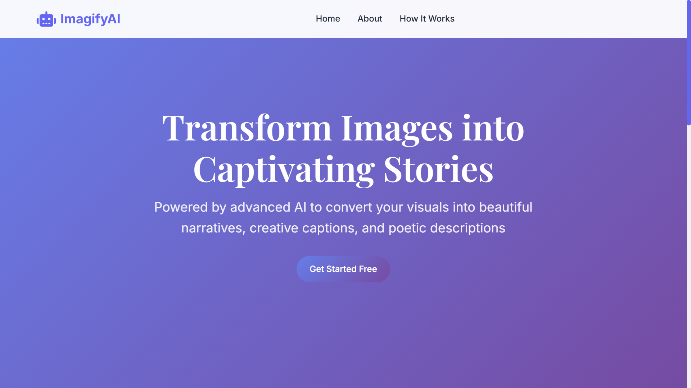
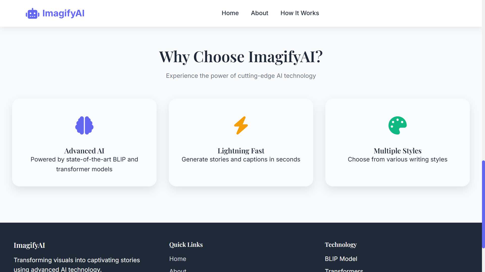
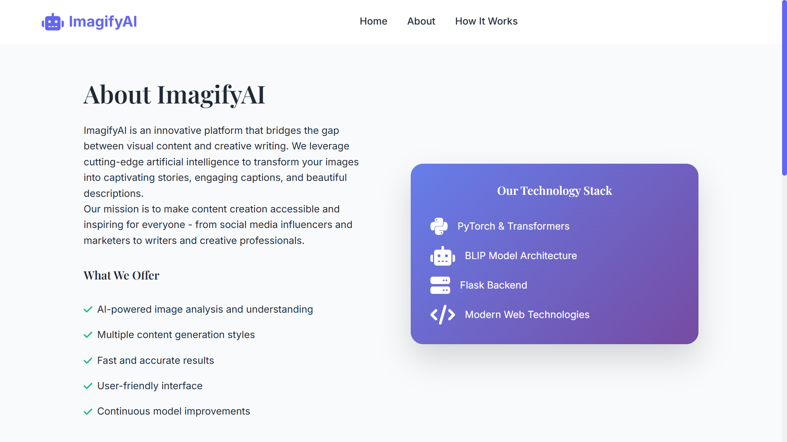
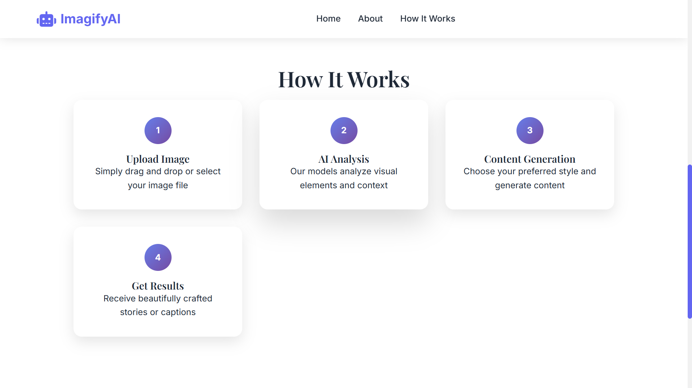
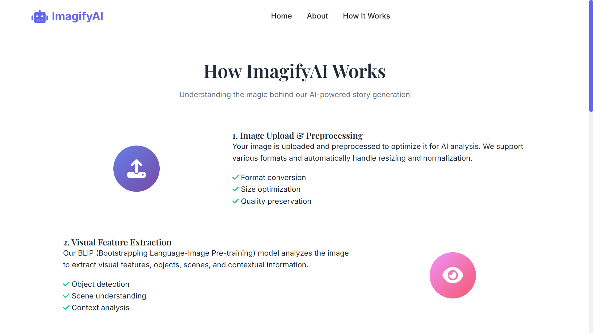
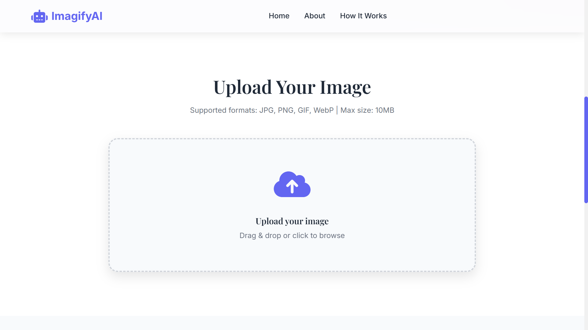
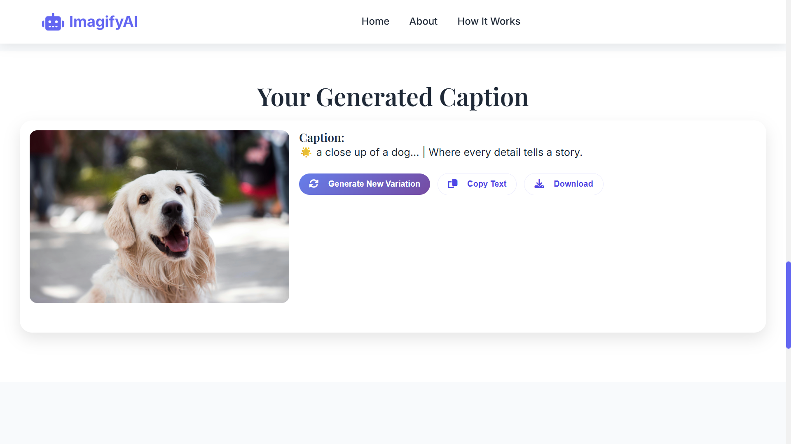
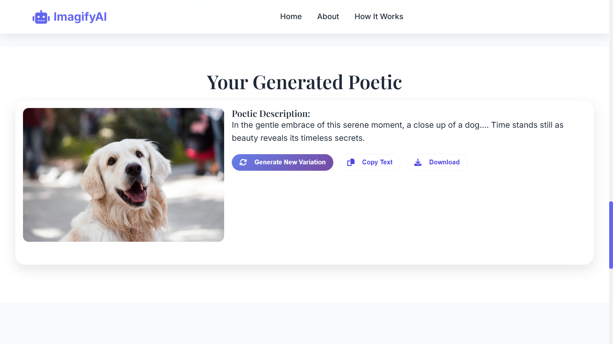

# 🎨 Imagify – AI Image to Story & Caption Generator

<p align="center">
  
</p>

<p align="center">
  <b>Transform images into immersive stories, poetic descriptions, and social‑ready captions using Vision‑Language AI.</b>
</p>

<p align="center">
  
  
  
  
</p>

---

## 🎥 Demo Video

> A complete walkthrough of Imagify’s AI‑powered image understanding and story generation workflow.

**▶ Click to play the demo video:**

[https://github.com/bhavyadoshi12/Imagify/raw/main/assets/video/Imagify.mp4](https://github.com/bhavyadoshi12/Imagify/raw/main/assets/video/Imagify.mp4)

---

## ✨ Key Features

### 🎯 Core Capabilities

* 🧠 **Vision‑Language Intelligence** using Salesforce **BLIP** for deep image understanding
* ✍️ **Multi‑Style Generation**

  * 📖 Creative Stories
  * 🎼 Poetic Descriptions
  * 💬 Smart Social Captions
* ⚡ **Real‑Time Inference Pipeline** with optimized model loading
* 🖥️ **Clean & Intuitive UI** for seamless user experience

### 🧩 AI Design Highlights

* Context‑aware caption extraction
* Dynamic prompt construction based on user style selection
* Narrative enhancement layer for human‑like storytelling
* Extensible architecture for future LLM integration

---

## 🖥️ Application Screenshots

<details>
<summary><b>📸 Click to view application UI</b></summary>

### 🏠 Home Interface




### ℹ️ About Section





### ⚙️ How It Works – Flow




### 📤 Image Upload



### 🎭 Output Type Selection


### 💬 Generated Caption



### 📖 Generated Story


### 📖 Generated Poetic




</details>

---

## 🚀 Quick Start

### ✅ Prerequisites

* Python 3.8+
* 4GB+ RAM (8GB recommended)
* Internet access (for first‑time model download)

### ⚙️ Installation & Run

```bash
git clone https://github.com/bhavyadoshi12/Imagify.git
cd Imagify
```

```bash
python -m venv .venv
source .venv/bin/activate   # Windows: .venv\\Scripts\\activate
```

```bash
pip install -r requirements.txt
python app.py
```

🌐 Open **[http://localhost:5000](http://localhost:5000)** in your browser

---

## 🧠 How It Works (AI Pipeline)

```text
User uploads an image
        ↓
BLIP Vision‑Language Model
        ↓
Semantic context extraction (objects, mood, scene)
        ↓
Dynamic prompt generation (Story / Poem / Caption)
        ↓
AI‑enhanced narrative synthesis
        ↓
Final output rendered in UI
```

---

## 🛠️ Tech Stack

| Layer     | Tools                                     |
| --------- | ----------------------------------------- |
| Backend   | Python, Flask                             |
| AI / ML   | PyTorch, Hugging Face Transformers (BLIP) |
| Frontend  | HTML, CSS, JavaScript                     |
| Utilities | Pillow, NumPy                             |

---

## 🔮 Future Enhancements

* 🤖 LLM‑powered creative expansion (OpenAI / GPT)
* 🎚️ Creativity & tone controls
* ☁️ Dockerized cloud deployment

---

## 👨‍💻 Author

**Bhavya Doshi**
🔗 GitHub: [https://github.com/bhavyadoshi12](https://github.com/bhavyadoshi12)

---

⭐ If you found this project helpful, consider giving it a **star**!
