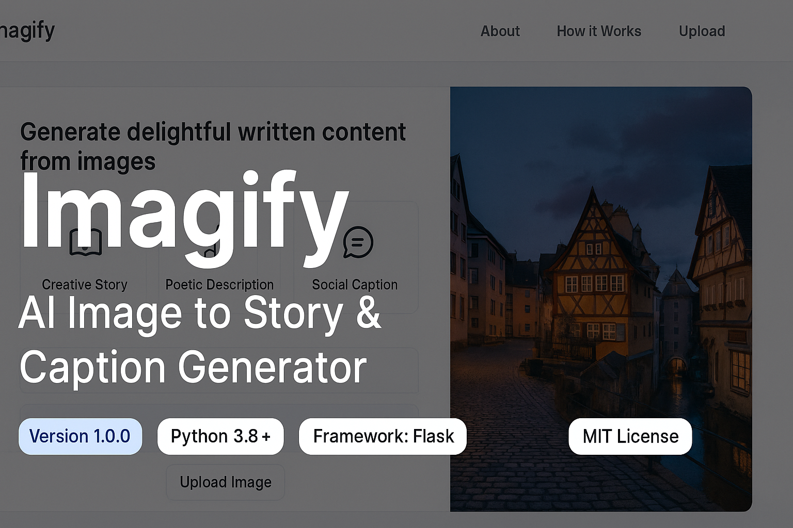

# 🎨 Imagify — AI Image to Story & Caption Generator

<p align="center">
  
</p>

<p align="center">
  <b>Transform images into immersive stories, poetic descriptions, and social-ready captions using Vision-Language AI.</b>
</p>

<p align="center">
  
  
  
  
</p>

---

## 🌐 Live Demo

Experience **Imagify** live without local setup:

🔗 **Hugging Face Spaces Demo**  
👉 https://huggingface.co/spaces/doshibhavya/Imagify

---

## 📖 Overview

**Imagify** is an AI-powered application that converts images into **creative stories**, **poetic narratives**, and **social-media-ready captions** using advanced **Vision-Language models**.

Powered by Salesforce **BLIP**, Imagify understands visual context—objects, emotions, scenes—and generates **human-like textual narratives** through dynamic prompt engineering and narrative enhancement layers.

This project is ideal for:
- 🧑‍🎨 Content creators  
- 📱 Social media automation  
- 🎥 Visual storytelling  
- 🧠 Vision-Language AI research  
- ✍️ Creative writing assistance  

---

## 🎥 Demo Video

> A complete walkthrough of Imagify’s AI-powered image understanding and generation pipeline.

▶ **Demo Video:**  
https://github.com/bhavyadoshi12/Imagify/raw/main/assets/video/Imagify.mp4

---

## ✨ Key Features

### 🎯 Core Capabilities

- 🧠 **Vision-Language Intelligence** using Salesforce **BLIP**
- ✍️ **Multi-Style Generation**
  - 📖 Creative Stories  
  - 🎼 Poetic Descriptions  
  - 💬 Smart Social Captions  
- ⚡ **Real-Time Inference Pipeline**
- 🖥️ **Clean & Intuitive UI**

### 🧩 AI Design Highlights

- Context-aware caption extraction
- Dynamic prompt construction based on output type
- Narrative enhancement for natural storytelling
- Extensible architecture for future LLM integration

---

## 🖥️ Application Screenshots

<details>
<summary><b>📸 Click to view application UI</b></summary>

### 🏠 Home Interface


### ℹ️ About Section


### ⚙️ How It Works – Flow


### 📤 Image Upload


### 🎭 Output Type Selection


### 💬 Generated Caption


### 📖 Generated Story


### 🎼 Generated Poetic Description


</details>

---

## 🚀 Quick Start

### ✅ Prerequisites

- Python 3.8+
- 4GB+ RAM (8GB recommended)
- Internet access (for first-time model download)

---

### ⚙️ Installation & Run

```bash
git clone https://github.com/bhavyadoshi12/Imagify.git
cd Imagify
````

```bash
python -m venv .venv
source .venv/bin/activate   # Windows: .venv\Scripts\activate
```

```bash
pip install -r requirements.txt
python app.py
```

🌐 Open **[http://localhost:5000](http://localhost:5000)** in your browser

---

## 🧠 How It Works (AI Pipeline)

```text
User uploads an image
        ↓
BLIP Vision-Language Model
        ↓
Semantic context extraction (objects, mood, scene)
        ↓
Dynamic prompt generation (Story / Poem / Caption)
        ↓
Narrative enhancement layer
        ↓
Final output rendered in UI
```

---

## 🛠️ Tech Stack

| Layer     | Tools                                     |
| --------- | ----------------------------------------- |
| Backend   | Python, Flask                             |
| AI / ML   | PyTorch, Hugging Face Transformers (BLIP) |
| Frontend  | HTML, CSS, JavaScript                     |
| Utilities | Pillow, NumPy                             |

---

## 🔮 Future Enhancements

* 🤖 LLM-powered creative expansion (GPT / LLaMA)
* 🎚️ Creativity, tone & length controls
* ☁️ Dockerized & scalable cloud deployment

---

## 👨‍💻 Author

**Bhavya Doshi**
🔗 GitHub: [https://github.com/bhavyadoshi12](https://github.com/bhavyadoshi12)

---

⭐ If you found this project useful, consider giving it a **star** — it really helps!


